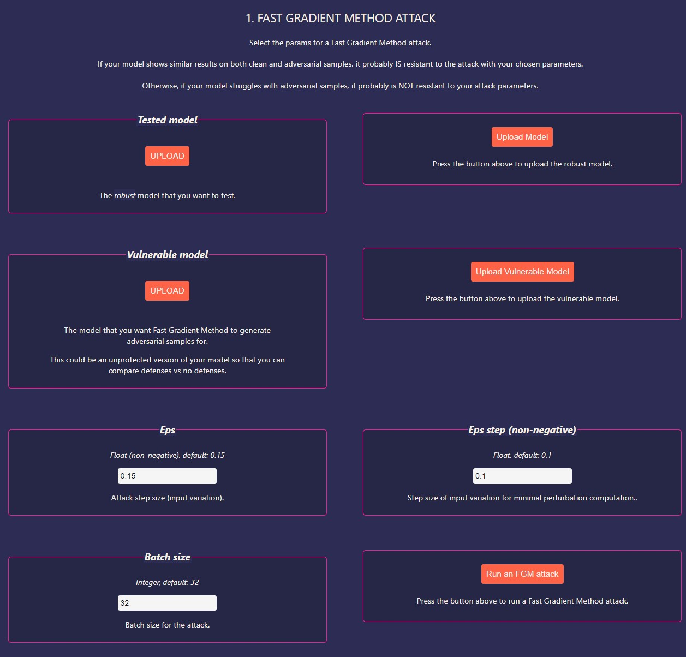
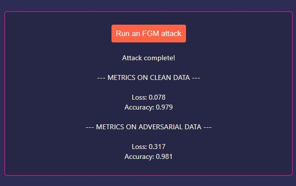
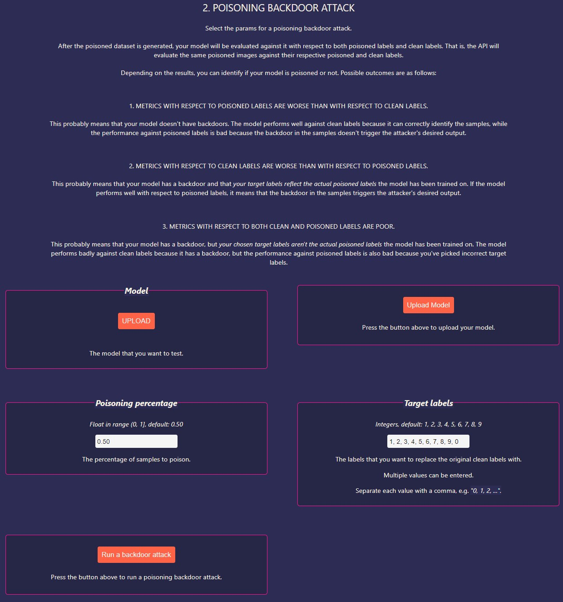
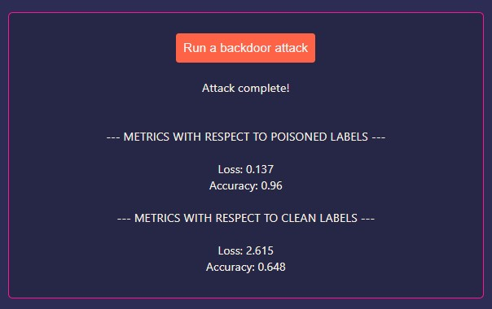
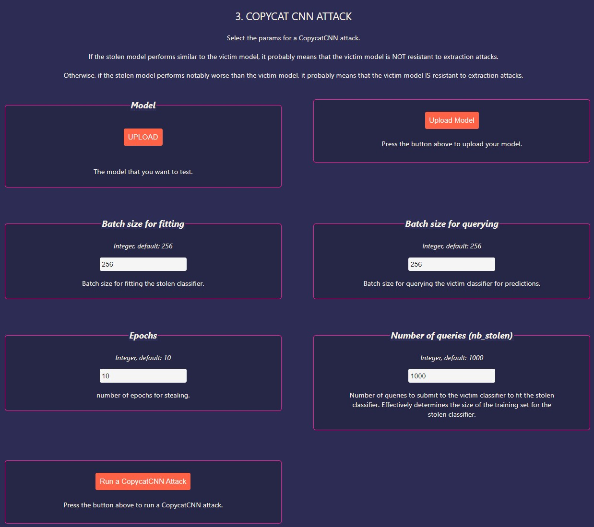
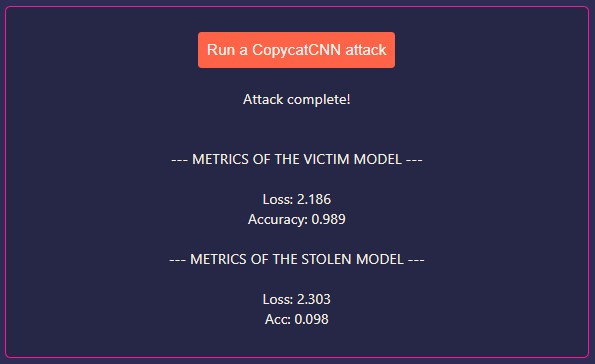

This repository contains the project for the post [ML Security with the Adversarial Robustness Toolbox: Part 3 – Building an AI Defense Tester with ART] on the Kedion blog on Medium.

## Clone Project

Clone the project:

`git clone https://github.com/tavetisyan95/art_web_app.git`


## Set the `api_url`

In the directory `app/art_web_app/src/` inside `config.js`, edit the API URL, port, and endpoints, if necessary. The default config should work for most people.

```
export const config = {
  api_url: "localhost",
  api_port: 5000,  
  upload_model_endpoint: "/upload-model",
  run_fgm_endpoint: "/run-fgm",
  run_backdoor_endpoint: "/run-backdoor",
  run_copycatcnn_endpoint: "/run-copycatcnn"
};
```

NOTE: don't put any http or slashes/backslashess in the api_url!


## Install Dependencies and Start Web Servers

To start the application's Docker container, launch Docker Desktop. Then, navigate to the root directory of the application, launch the terminal, and run the following command:

`docker-compose -f docker-compose.yaml up -d –build`

It may take some time for the app to spin up. Once you see terminal messages that the containers are up, navigate to `http://localhost:3000` in your web browser to open the application's webpage.

ALTERNATIVELY, you can run the `start.sh` shell script to start the web app without Docker. Run the command `bash start.sh` in the terminal to launch the shell script. If you are on Windows, you can use Git Bash to run shell scripts. Note that you may need to modify the paths in the API and JS files for the app to work outside of Docker.


## Attacks Implemented in the App

Our app implements the following attacks:

- Fast Gradient Method (evasion).
- Poisoning Backdoor (poisoning).
- CopycatCNN (extraction).

The app is designed for models trained on the MNIST digits dataset - the training/testing data is hardcoded in the API. TF/Keras models are expected. The app should work with various model architectures, but we haven't tested model support. You may run into issues with model architectures that are different from that in our sample models.

We provide pretrained test models in the directory `models`. However, if you want to train your own models, use the code in [this repository]. The code you'll find there is the exact same code we used to train our test models.


### 1. Running a Fast Gradient Method attack against your model

The first attack to try in the app is the Fast Gradient Method (FGM) attack.



To run an FGM attack, you will need to upload two models:

- **Tested model** - this is the model that you want to test against the attack. This could be a robust model trained with the Adversarial Trainer.
- **Vulnerable model** - this is the model that FGM will learn to generate adversarial samples for. This model should be similar to your tested model.

Use `models/robust_model_fgm.h5` as `Tested model` and `models/vulnerable_model_fgm.h5` as `Vulnerable model`. To upload the models, click on the `UPLOAD` buttons on the left-hand side of the window and select the desired model files. After that, click `Upload Model` and `Upload Vulnerable Model` to upload the models to the web server.

You can adjust three parameters for FGM - `eps`, `eps_step`, and `batch_size`. The default values in the app work for the supplied test models, but you could try different values to see how the attack's results change. The batch size probably will not affect the attack's effectiveness.

After everything is ready, press `Run an FGM attack`. You should see the progress of the attack in the terminal window from which you launched the app. Once the attack is complete, the app will return two sets of scores:

- **Metrics on clean data** - these show the performance of the tested model on clean samples.
- **Metrics on adversarial data** - these show the performance of the tested model on FGM samples.



If your model shows similar results on both clean and adversarial samples, it probably IS resistant to the attack with your chosen parameters.

Otherwise, if your model struggles with adversarial samples, it probably is NOT resistant to your attack parameters.


### 2. Running a Poisoning Backdoor attack against your model

The second attack you can try is the poisoning backdoor attack.



You again start by uploading your model to the web server. For this attack, you can use any of the supplied models. However, to see how the app can help you determine if your model is poisoned, use `models/poisoned_model.h5`.

`poisoned_model.h5` was trained with the perturbation `add_pattern_bd`. The fake labels are just the original labels incremented by 1. So `0 -> 1`, `1 -> 2`, and so on. For the digit `9`, the fake label is `0`.

After you upload the model, you can adjust `Poisoning percentage` and `Target labels`. 

- `Poisoning percentage` determines the fraction of the original clean samples to poison in the range `(0, 1]`. The poisoned samples are added to the original clean ones, so you essentially get a dataset that was augmented with poisoned samples.
- `Target labels` by default defines the same fake labels that were used to poison `poisoned_model.h5`. You can try other target values as well, which might affect the attack results.

After you are done with the parameters, click `Run a backdoor attack`. After the attack is complete, you will again see two sets of metrics:

- **Metrics with respect to poisoned labels** - these show the performance of the tested model on *poisoned samples* against their respective *poisoned labels*.
- **Test loss and accuracy on adversarial data** - these show the performance of the tested model on *poisoned samples* against their respective *clean labels*.



Your results could be as follows:

1. **METRICS WITH RESPECT TO POISONED LABELS ARE WORSE THAN WITH RESPECT TO CLEAN LABELS.** This probably means that your model doesn't have backdoors. The model performs well against clean labels because it can correctly identify the samples, while the performance against poisoned labels is bad because the backdoor in the samples doesn't trigger the attacker's desired output.

2. **METRICS WITH RESPECT TO CLEAN LABELS ARE WORSE THAN WITH RESPECT TO POISONED LABELS.** This probably means that your model has a backdoor and that your target labels reflect the actual poisoned labels the model has been trained on. If the model performs well with respect to poisoned labels, it means that the backdoor in the samples triggers the attacker's desired output.

3. **METRICS WITH RESPECT TO BOTH CLEAN AND POISONED LABELS ARE POOR.** This probably means that your model has a backdoor, but your chosen target labels aren't the actual poisoned labels the model has been trained on. The model performs badly against clean labels because it has a backdoor, but the performance against poisoned labels is also bad because you've picked incorrect target labels.


### 3. Running the CopycatCNN attack against your model

The third and final attack type you can try is CopycatCNN.



You again start by uploading the model. The model `models/postprocessed_model.h5` has the same architecture as the other test models, but it has a custom Reverse Sigmoid layer as its output. This model will be resistant to extraction attacks, while the others probably won't be.

You can adjust the following parameters for this attack:

- **Batch size for fitting** and **Batch size for querying**. These parameters control the batch size for fitting the stolen model and querying the victim model. Use larger batch sizes to speed up extraction, but mind OOM (out of memory) issues.
- **Epochs**. This is the number of epochs that CopycatCNN trains the stolen model for.
- **Number of queries**. This parameter corresponds to `nb_stolen` of ART's `CopycatCNN` class. It effectively determines the size of the training set for the stolen classifier.

After you are done, just click `Run a CopycatCNN attack`. You will once again see two sets of performance metrics:

` **Metrics of the victim model**. These are the performance metrics of the victim model that CopycatCNN tried to steal against the clean test set.
` **Metrics of the stolen model**. These are the performance metrics of the stolen model against the clean test set.



If the stolen model performs similar to the victim model, it probably means that the victim model is NOT resistant to extraction attacks.

Otherwise, if the stolen model performs notably worse than the victim model, it probably means that the victim model IS resistant to extraction attacks.

NOTE 1: the test loss will be high even for the protected victim model because of the Reverse Sigmoid output. This output significantly changes the magnitude of the loss for the model. This is because when evaluating the model, Reverse Sigmoid outputs aren't converted back to standard softmax.

NOTE 2: the performance of the stolen model may vary significantly from run to run. We saw test accuracy between ~ 0.1 and ~0.75. It appears that the variance is due to ART's implementation of `TensorFlowV2Classifier` wrapper class. To our knowledge, `KerasClassifier` produces more consistent results.

 
## LIMITATIONS OF THE APP

- Invalid inputs for parameters aren't handled. No error messages are shown in the web browser. The only way to know that something has gone wrong is through terminal logs.